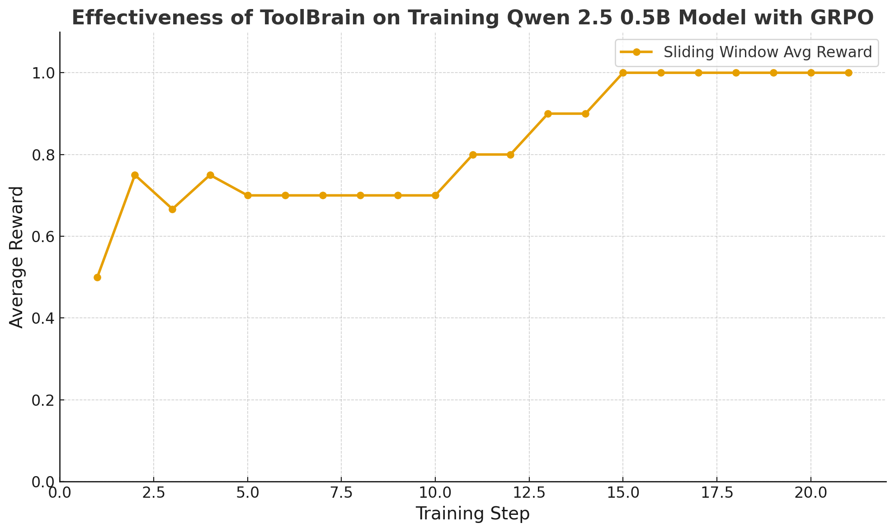

# ToolBrain 🧠

ToolBrain is a lightweight open-source Python library for training **agentic systems** with effective tool usage and built-in reinforcement learning.  
📚 Documentation & tutorials: [toolbrain.org](https://toolbrain.org)

Support us by giving ToolBrain a ⭐ on GitHub.
## ✨ Key Features

- **🤖 Learning algorithms**: Supports [GRPO](examples/02_lightgbm_hpo_training_with_grpo/run_hpo_training.py), [DPO](examples/04_lightgbm_hpo_training_with_dpo/run_hpo_training.py), and [supervised learning](examples/05_supervised_training.py).  
- **🎯 Flexible rewards**: Define your own reward functions or use LLM-as-judge.  
- **🔧 Tool management**: Scalable [retrieval](examples/06_tool_retrieval.py) for managing large tool collections.  
- **📊 Knowledge distillation**: [Distill](examples/08_distillation.py) large teacher models into smaller student models for efficiency.  
- **🚀 Zero-learn**: Automatically [generate training tasks](examples/03_generate_training_examples.py ).  
- **⚡ Efficient training**: Supports LoRA, Unsloth, and BitsAndBytes for [resource-efficient training](examples/07_email_search_agent/).  

## 🚀 Getting Started

### Prerequisites
- Python **3.10+**

### Installation

Create conda env (optional)
```bash
conda create --name toolbrain python=3.12
conda activate toolbrain
```

From PyPI:  
```bash
pip install toolbrain
```

Or from the source code:
```bash
git clone git@github.com:ToolBrain/ToolBrain.git
```

Enter the cloned folder and type:
```bash
pip install .
```


### Run the Example

Run the complete example to see ToolBrain in action (please see under examples folder for more advanced usage examples):

```bash
python examples/01_run_hello_world.py
```

This will:
- Initialize a `CodeAgent` with simple math tools
- Define a customised reward function
- Run the GRPO algorithm

## 📖 Usage Example

Here's a minimal example of how to use ToolBrain. This script demonstrates simplified ToolBrain API:
1. Create a smolagent CodeAgent
2. Create a brain with our main class Brain() 
3. Train the agent with the GRPO algorithm


```python
from smolagents import tool, TransformersModel, CodeAgent
from toolbrain import Brain
from toolbrain.rewards import reward_exact_match

# --- 1. Define Tools and Reward Function (User-defined) ---
@tool
def add(a: int, b: int) -> int:
    """
    Add two integers.

    Args:
        a (int): First addend.
        b (int): Second addend.

    Returns:
        int: Sum of a and b.
    """
    return a + b


# --- 2. Prepare Training Data ---
training_dataset = [
    {
        "query": "Use the add tool to calculate 5 + 7",
        "gold_answer": "12"
    }
]


# 3. Create agent
model = TransformersModel(
    model_id="Qwen/Qwen2.5-0.5B-Instruct",  # use a bigger model for better results
    max_new_tokens=128
)

agent = CodeAgent(
    model=model,
    tools=[add],
    max_steps=1
)

# 4. Create Brain

brain = Brain(
    agent,                          # Agent instance
    algorithm="GRPO",                # Algorithm choice
    reward_func=reward_exact_match  # A reward function, you can customise any python function as reward
)

# 5. Train the agent with GRPO steps
brain.train(training_dataset, num_iterations=10)
```
 ### Results
The following plot illustrates how ToolBrain enhances the tool usage accuracy of the small Qwen/Qwen2.5-0.5B-Instruct model after just 20 training steps using GRPO.


## 📄 License

This project is licensed under the MIT License - see the [LICENSE](https://opensource.org/licenses/MIT) for details.


## Contributors
Quy Minh Le, Minh Sao Khue Luu, [Khanh-Tung Tran](https://www.linkedin.com/in/khanh-tung-tran-83b3541ab), Duc-Hai Nguyen, Hoang-Quoc-Viet Pham,  Quan Le, [Hoang Thanh Lam](https://research.ibm.com/people/thanh-hoang) and [Hoang D. Nguyen](https://www.ucc.ie/en/compsci/people/harrynguyen/)


## References
Please cite [our paper](https://arxiv.org/abs/2510.00023) with the following bibtex:
```
@misc{le2025toolbrainflexiblereinforcementlearning,
      title={ToolBrain: A Flexible Reinforcement Learning Framework for Agentic Tools}, 
      author={Quy Minh Le and Minh Sao Khue Luu and Khanh-Tung Tran and Duc-Hai Nguyen and Hoang-Quoc-Viet Pham and Quan Le and Hoang Thanh Lam and Hoang D. Nguyen},
      year={2025},
      eprint={2510.00023},
      archivePrefix={arXiv},
      primaryClass={cs.AI},
      url={https://arxiv.org/abs/2510.00023}, 
}
```

**Made with ❤️ by the ToolBrain Team** 
